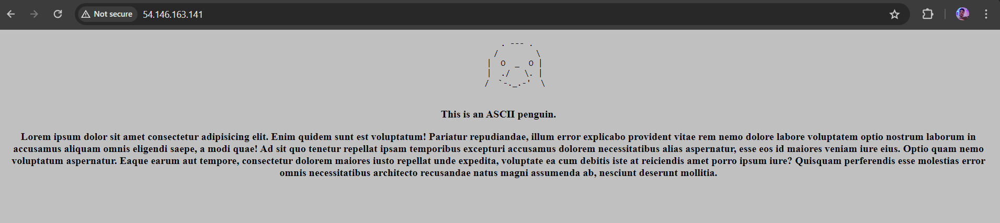
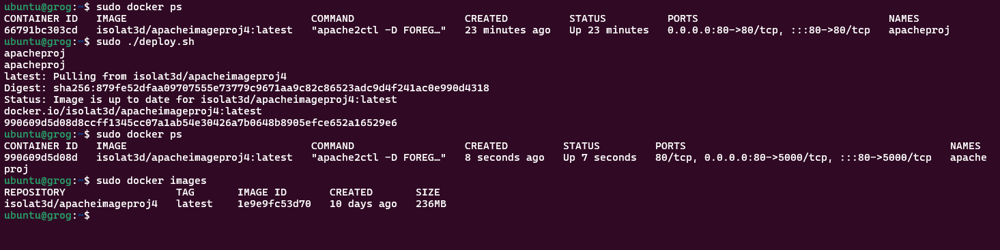
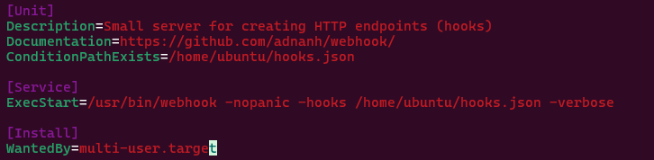
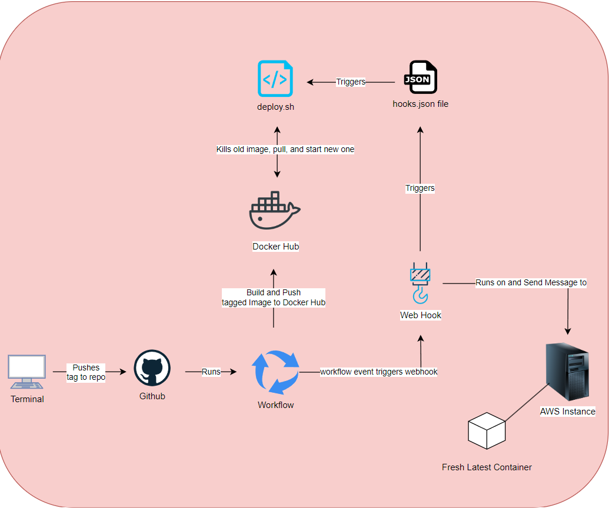

# Documentation Project 5 Part 1
  - Overview
    - What
      - In the workflows `main.yml` file we are now implementing semantic versioning with a `major` and `major.minor` verison. This now allows me to keep versions of my image as changes are made along with the `latest` version. The workflow runs when a version/git tag is pushed in a specifed format, `v*.*.*`, this then pushes my image along with the version/tag to Docker Hub.
    - Why
      - This concept of tags and versioning are image allow us to show someone who pulls my image that there is development being done and there are diffrent versions of the container image. The tag for the image is the version and depending on that version there is diffrences between the images whether it be a major, minor, or patch difference.
    - Tools
      - All you need is your workflows `main.yml` file from Project 4 and you need to use the `git tag` command to make tags. Finally you need a GitHub action called `docker/metadata-action` which will allow you to configure and manage your semantic versioning.
  - Generate tags
    - In Github to make a tag you need to use `git tag -a v*.*.* -m "msg goes here"`. Make sure the `v*.*.*` portion matches the workflows `yml` file tag formating under `on:push:tags:`. Once the tag is made do `git push origin v*.*.*`.
  - Behavior
    - The workflow currently runs whenever there is a tag that is pushed to the git repo. Once the tag is pushed it checkouts the main branch, uses the Git Action docker metadata action for getting the docker image tag/verison, logs in to Docker Hub, and finally builds and pushes the images with the tagged verisons.
  - [Link to my Docker Hub Repo](https://hub.docker.com/repositories/isolat3d) 

# Documentation Project 5 Part 2
  - [How to install Docker on AWS Instance/Ubuntu](https://docs.docker.com/engine/install/ubuntu/)
    - Do `sudo apt-get update`
    - `sudo apt-get install ca-certificates curl`
    - `sudo install -m 0755 -d /etc/apt/keyrings`
    - `sudo curl -fsSL https://download.docker.com/linux/ubuntu/gpg -o /etc/apt/keyrings/docker.asc`
    - `sudo chmod a+r /etc/apt/keyrings/docker.asc`
    - Then do `echo \
  "deb [arch=$(dpkg --print-architecture) signed-by=/etc/apt/keyrings/docker.asc] https://download.docker.com/linux/ubuntu \
  $(. /etc/os-release && echo "$VERSION_CODENAME") stable" | \
  sudo tee /etc/apt/sources.list.d/docker.list > /dev/null
sudo apt-get update` 
  - Docker Image Container running in AWS Instance (shows the eip of instance as proof):
    - 
  - Script to pull new image and restart:
    - The `delopy.sh` script is a script that allows us to create an automated process that kills an old container by stoping it, removing it, then a fresh image is pulled, finally a new container is run and then always restarts the container if it stops.
    - The `deploy.sh` is in the users home directory.
    - 
  - Webhook:
    - Use `sudo apt-get install webhook` to install adnanh's webhook
    - What the webhook does is on an event, the workflow run, the webhook triggers which runs the `delpoy.sh` script.
    - The webhooks `.json` should be in the home directory of the user. In terms of the actuall service itself that is in `/lib/systemd/system`
    - For the webhook to start you need to vim the webhook.service file in the `/lib/systemd/system` and configure it to point to your `.json` file for your hook in the home directory.
    - For `ConditionPathExists` point to the `.json` file that has your hook configured by specifiying the path to it.
    - In `ExecStart` after `-hooks` put your path from the `ConditionPathExists` and add `-verbose` to see the details
    - 
    - Once this is all done do `sudo systemctl daemon-reload` then `sudo systemctl restart webhook.service` because the changes where made to the webhook service file and once this is done the changes will take effect.
    - To configure Github to message the listener go to the repos settings and click on the webhooks setting. Put the url of the hook in the webhook payload url section. Then choose select individual event, choose workflow run event, and add the webhook.

# Documentation Project 5 Part 3

# Resources
 - https://semver.org/
 - https://github.com/adnanh/webhook
 - https://docs.docker.com/engine/install/ubuntu/
 - https://git-scm.com/book/en/v2/Git-Basics-Tagging
 - https://docs.docker.com/build/ci/github-actions/manage-tags-labels/

# Personal Note to Self
DO NOT FORGET THE `|` in the `docker/metadata-action`
