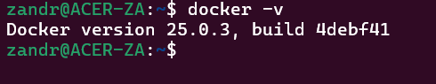

# Documentation Part 1
- Overview
  - What:
    - We are creating a Docker Image using a Dockerfile to set up a container that servers web content using apache2 
  - Why:
    - This is to show that with images and containers there is ease of portability, scalability and allows isolation of processes
  - Tools:
    - Docker Desktop for WSL, Github, Dockerfile (Ubuntu base image, apache2) 
- How To
  - Install docker and dependencies
    - I'm using Windows so I downloaded Docker Desktop online and ran the installer which also downloaded the dependancies and started Docker Desktop to then use in WSL
    - 
  - Build an image from the `Dockerfile`
    - Once the dockerfile is created and configured use `docker build -t <name_of_image_here>:<tag> .`
      - The `-t` lets you name the image
      - The `.` specifies PATH which in this case in the context of docker build it located the Dockerfile in my current directory I am in
      - 
      - 
  - Run the container
    - To run the container use `docker run --name <container_name_here> -d -p 80:80 <image_name_here>:<tag>`
      - The `-d` is detached mode which runs the container in the background
      - The `-p` is portfowarding the host port 80 and mapping it to the container on port 80 so traffic on host port 80 is forwarded to port 80 on the container
      - 
  - View the running container
    - To view the running container you can go to your web browser and type localhost or you can type in the loopback interface ip
    - 

# Documentation Part 2
 - Make Docker Hub repo:
   - Log into Docker Hub and click on repositories
   - Click create repository
   - Use your account username in namespace and name your repo
   - Add a discription if you want and then choose vibility option (Public or Private)
 - Authenticate to Docker Hub with CLI (Command Line Interface):
   - On the command line do `docker login`
   - Enter your username and password
     - You can type your password in or use your Personal Acess Token (PAT) which is more perferred because of increased security
   - 
 - Push images to Docker Hub w/o using GitHub Actions:

# Resources
  - https://docs.docker.com/reference/cli/docker/image/build/
  - https://www.digitalocean.com/community/tutorials/apache-web-server-dockerfile
  - https://docs.docker.com/build/ci/github-actions/
  - https://github.com/marketplace/actions/build-and-push-docker-images
  - https://docs.github.com/en/actions/publishing-packages/publishing-docker-images#publishing-images-to-docker-hub
